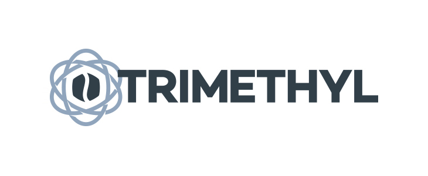

Trimethyl is a collection of very useful modules to work with **Appcelerator Titanium**.

Most of these modules are proxies for Titanium API, and some of these add missing features or expose useful functions for cross platform development.

#### [Check the API Documentation](http://caffeinalab.github.io/trimethyl)

#### [Check the Wiki](https://github.com/caffeinalab/trimethyl/wiki)

#### [Download Dash Kapeli Docset](https://github.com/caffeinalab/trimethyl/blob/master/docset/Trimethyl.tgz?raw=1)

---


[](https://gitter.im/CaffeinaLab/Trimethyl?utm_source=badge&utm_medium=badge&utm_campaign=pr-badge&utm_content=badge)

## Installation via NPM

[](https://npmjs.org/package/trimethyl)

Install globally with npm:

```
[sudo] npm install -g trimethyl
```

In your Titanium project, now you have the command `trimethyl`, run:

```
trimethyl install
```

## Configure modules

You can specify which modules you want to install, just type:

```
trimethyl add {module}
```

Or edit the `trimethyl.json` file in your project directory.

## Configuration

Each module reads from the **config.json** your personal configuration, extending its default.

For example, the module named `{Module}`, will read the `Alloy.CFG.T.{module}` object; the submodule `{Sub}` of `{Module}`, will read `Alloy.CFG.T.{module}.{submodule}`; etc..

You can customize the options, editing your **config.json** file:

```javascript
{
	"T":{
		"module": {
			...
			"sub": {
				...
			}
		},
	}
}
```

## Initialization

In your *app/alloy.js* file:

```javascript
T = function (name) { return require('T/'+name); }
T('trimethyl');
```

`T` it's an easier method to load Trimethyl modules.

Requiring **trimethyl** by `T('trimethyl')` module on startup will bootstrap some important framework files, set prototypes, TSS vars and `Alloy.Globals` variables.

## Modules

To use a module, just require with `T` helper:

```javascript
var Util = T('util'); /* same of require('T/util') */
```

It's useful to declare global modules that you'll use in the entire app in the `alloy.js` file to make them available through the variable name.

## UIFactory module

This is an Alloy feature: the ability to create UI objects directly from Alloy Views, using the `module` keyword. For example:

```xml
<Alloy>
	<Window title="Awesome window" module="T/uifactory">
		<TextField module="T/uifactory" />
	</Window>
</Alloy>
```

You can obviously wrap these elements again with your own modules, creating a further module, for example creating a `ui.js` file in your `app/lib` directory:

```js
exports.createWindow = function(args) {
	var $el = T('uifactory').createWindow(args);

	// ...

	return $el;
}
```


## API Documentation

**Please refer to the [documentation](http://caffeinalab.github.io/Trimethyl/) for full-usage of all APIs**.

#### Dash Kapeli URL

```
dash-feed://https%3A%2F%2Fraw.githubusercontent.com%2Fcaffeinalab%2Ftrimethyl%2Fmaster%2Fdocset%2FTrimethyl.xml
```


## Copyright and license

Copyright 2014 [Caffeina](http://caffeina.co) srl under the [MIT license](LICENSE).
